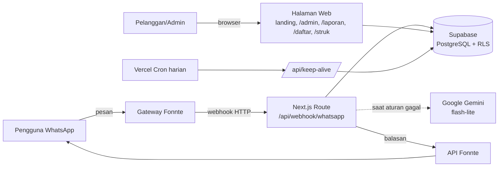
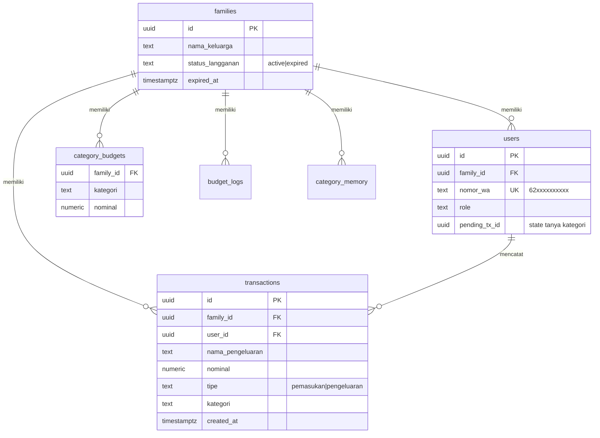
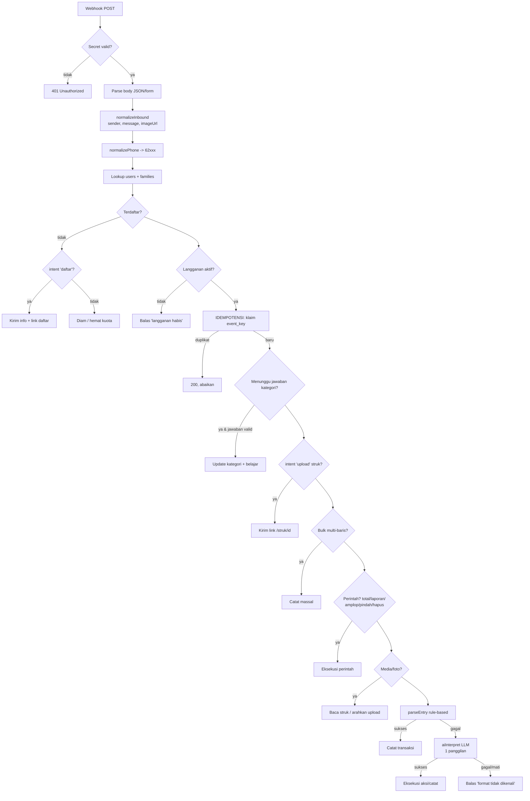
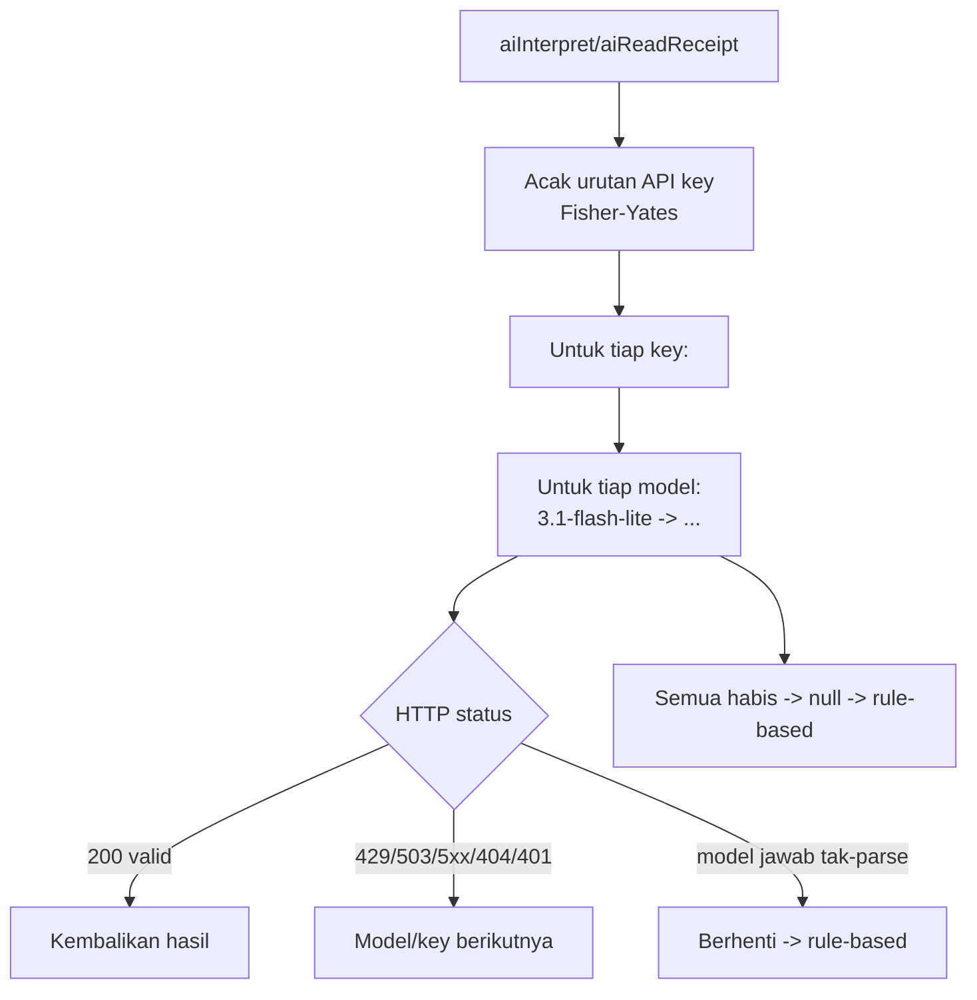
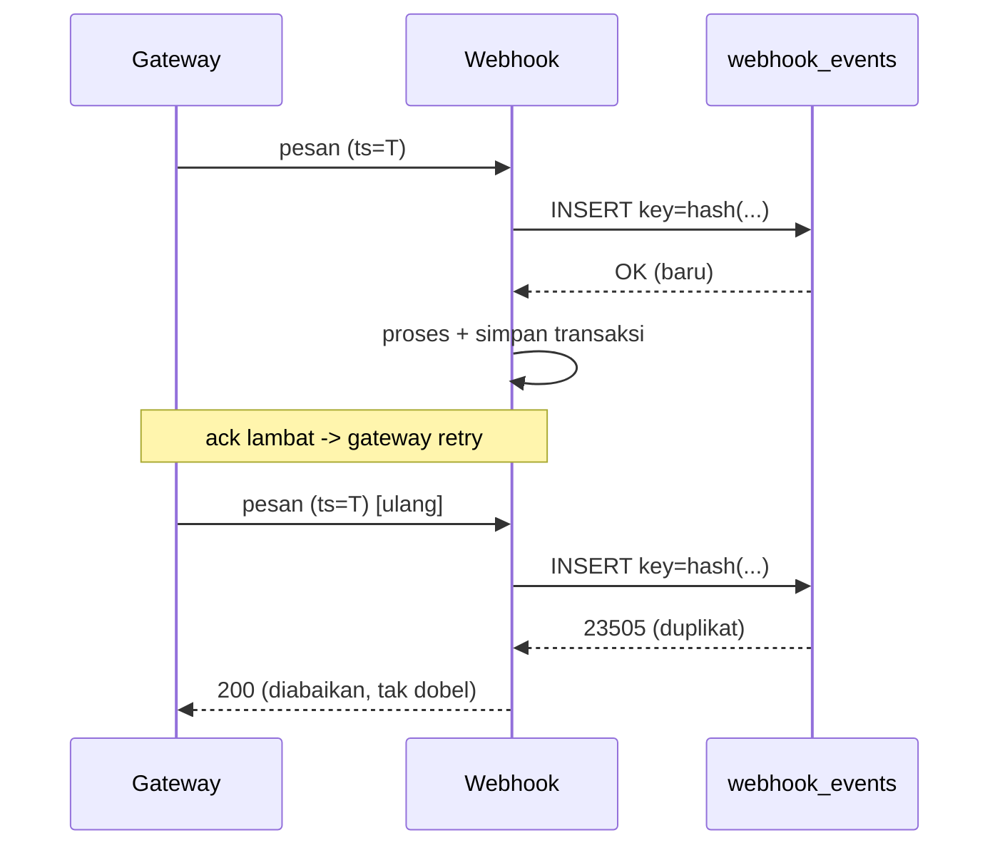

# Dokumen Teknis Sistem
## Dashboard Keuangan Keluarga Berbasis WhatsApp Multi-Tenant (SaaS) dengan Pemrosesan Bahasa Alami Hibrida (Rule-based + LLM)

> Dokumen ini mendokumentasikan arsitektur, model data, dan algoritma inti sistem
> untuk keperluan penulisan tesis/paper S2. Bagian **Analisis**, **Tinjauan
> Pustaka**, **Metodologi Penelitian**, dan **Evaluasi Empiris** perlu ditulis
> sendiri oleh peneliti; dokumen ini menyediakan deskripsi teknis sistem yang
> menjadi objek penelitian.

---

## 1. Ringkasan Sistem

Sistem adalah aplikasi **Software-as-a-Service (SaaS) multi-tenant** untuk
pencatatan keuangan keluarga yang dioperasikan sepenuhnya melalui **WhatsApp**.
Satu nomor bot WhatsApp terpusat melayani banyak keluarga; sistem membedakan
kepemilikan data berdasarkan **nomor telepon pengirim**. Pengguna mencatat
transaksi dengan bahasa sehari-hari (mis. `Bensin 50rb`), dan sistem mengekstrak
`{tipe, nama, nominal, kategori}` menggunakan pendekatan **hibrida**: parser
berbasis aturan (rule-based) sebagai jalur utama, dan **Large Language Model
(LLM)** sebagai cadangan hanya saat aturan gagal.

### 1.1 Tujuan Rekayasa
1. **Aksesibilitas** — tanpa instalasi aplikasi; cukup WhatsApp.
2. **Isolasi multi-tenant** — data antar-keluarga tidak boleh bocor.
3. **Efisiensi biaya** — meminimalkan pemanggilan LLM berbayar/berkuota.
4. **Keandalan** — tahan terhadap duplikasi (retry) dan kegagalan komponen.

### 1.2 Tumpukan Teknologi (Technology Stack)

| Lapisan | Teknologi | Peran |
|---|---|---|
| Antarmuka pengguna | WhatsApp (via gateway Fonnte) | Kanal input/output utama |
| Web/Server | Next.js 15 (App Router), TypeScript | Webhook, halaman web, API |
| Komputasi | Vercel (serverless functions + Cron) | Hosting & penjadwalan |
| Basis data | Supabase (PostgreSQL + Row Level Security) | Penyimpanan multi-tenant |
| LLM (opsional) | Google Gemini (flash-lite) | NLU cadangan + OCR struk |
| Visualisasi | Chart.js | Grafik laporan |

---

## 2. Arsitektur Sistem



Sistem menganut pola **thin gateway, fat webhook**: gateway hanya meneruskan
pesan; seluruh logika bisnis berada di satu *route handler* server (`POST
/api/webhook/whatsapp`) yang bersifat *stateless* (setiap permintaan berdiri
sendiri; state ada di basis data).

### 2.1 Prinsip Desain Kunci
- **Server tepercaya memakai `service_role`** (melewati RLS) — isolasi tenant di
  jalur tulis ditegakkan oleh **kode** (selalu memakai `family_id` hasil lookup
  server, tidak pernah dari input klien).
- **Lapisan adapter** untuk gateway keluar (`response` / `fonnte` / `cloud`) dan
  provider AI — memudahkan migrasi tanpa mengubah logika inti.
- **Rule-based first, AI last** — LLM hanya dipanggil saat aturan gagal.

---

## 3. Model Data dan Isolasi Multi-Tenant

### 3.1 Diagram Relasi Entitas (ERD)



Tabel pendukung: `budget_logs` (riwayat perubahan amplop), `category_memory`
(pembelajaran nama→kategori), `pricing_config` & `packages` (harga langganan),
`registrations` (pendaftaran mandiri), `webhook_events` (idempotensi).

### 3.2 Row Level Security (RLS)

Setiap tabel tenant mengaktifkan RLS. Fungsi bantu memetakan pengguna terautentikasi
(dashboard) ke `family_id`-nya:

```sql
create function current_family_id() returns uuid
language sql stable security definer set search_path = public as $$
  select family_id from users where auth_user_id = auth.uid() limit 1;
$$;

create policy "tx: select own family" on transactions for select
  to authenticated using (family_id = current_family_id());
```

**Model ancaman & mitigasi:**

| Jalur akses | Kredensial | Penegakan isolasi |
|---|---|---|
| Webhook (server) | `service_role` (bypass RLS) | oleh **kode**: `family_id` dari lookup `sender` |
| Dashboard (browser) | `anon`/`authenticated` | oleh **RLS**: `current_family_id()` |
| `anon` tanpa login | — | ditolak total (tidak ada policy) |

---

## 4. Pipeline Pemrosesan Pesan (Alur Inti)

Setiap pesan masuk melewati pipeline berurutan. Urutan penting: pemeriksaan murah
& deterministik dulu, LLM paling akhir.



**Observasi desain:** LLM (kotak `P`) hanya dicapai bila seluruh jalur
rule-based (`I`–`O`) gagal. Untuk mayoritas pesan (format singkat), eksekusi
berhenti sebelum `P` → **nol biaya LLM**.

---

## 5. Ekstraksi Informasi Berbasis Aturan (Rule-based NLP)

Jalur utama pencatatan adalah parser deterministik berbahasa Indonesia.

### 5.1 Ekstraksi Nominal
Tiga strategi berjenjang dalam `parseTransactionMessage`:

1. **Angka digit + satuan** — regex `(\d+(?:[.,]\d+)*)\s*(jt|juta|rb|ribu|k)?`.
   Ambil kemunculan **terakhir** sebagai nominal (heuristik: nominal lazim di akhir
   kalimat). Satuan dikonversi (`rb/k`×1.000, `jt`×1.000.000).
2. **Angka dalam kata** (`parseIndoNumber`) — bila tak ada digit. Automaton
   akumulatif memproses token *satuan/belas/puluh/ratus/ribu/juta* dan awalan
   *"se-"*; contoh "dua ratus lima puluh ribu" → 250.000. Slang lokal
   (`goceng`=5.000, `ceban`=10.000) dipetakan langsung.
3. **Anti-galat** — angka-kata hanya diterima bila mengandung skala (ribu/juta/…)
   agar "satu bakso" tidak salah dibaca sebagai Rp1.

```
FUNGSI parseIndoNumber(teks):
  ekspansi awalan "se-" (sepuluh→satu puluh, seratus→satu ratus, …)
  result←0; group←0; unit←0
  UNTUK tiap token:
    JIKA token satuan(1..9):        unit ← nilai
    JIKA "belas":  group += 10+unit; unit←0
    JIKA "puluh":  group += (unit|1)*10;  unit←0
    JIKA "ratus":  group += (unit|1)*100; unit←0
    JIKA "ribu":   group += unit; result += (group|1)*1000;    group←0; unit←0
    JIKA "juta":   group += unit; result += (group|1)*1_000_000; group←0; unit←0
  KEMBALIKAN result + group + unit
```

### 5.2 Klasifikasi Tipe & Kategori
- **Tipe** ditentukan awalan (`masuk`/`pemasukan`/`terima`/`+` → pemasukan;
  selain itu pengeluaran).
- **Kategori** (`detectCategory`): (a) pencocokan kata kunci (kamus per kategori);
  (b) bila gagal, **fuzzy matching** jarak-edit Levenshtein ≤ 1 untuk toleransi
  salah ketik (mis. `bensn`→`bensin`→Transport); (c) override manual `#kategori`.

### 5.3 Pembelajaran Kategori (Adaptive)
Saat pengguna mengoreksi/menjawab kategori, pasangan **nama→kategori** disimpan
(`category_memory`). Transaksi berikutnya dengan nama serupa dikategorikan otomatis
tanpa bertanya lagi (pencocokan berbasis irisan kata kunci).

### 5.4 Interaksi Bertahap (Stateful Clarification)
Bila kategori tak terdeteksi, sistem mencatat sebagai "Lainnya", menyimpan
`pending_tx_id` pada baris pengguna, dan bertanya. Jawaban satu-kata pada pesan
berikutnya memperbarui transaksi tersebut — sebuah *dialog state machine* ringan
yang state-nya persist di basis data (bukan di memori proses serverless).

---

## 6. Sistem Amplop (Envelope Budgeting)

Model penganggaran per kategori ("amplop"). Perintah bahasa: `amplop makan 2jt`
(set), `pindah makan transport 500rb` (transfer), `hapus amplop makan`. Setiap
perubahan dicatat ke `budget_logs` untuk audit. Realisasi vs anggaran dihitung
per bulan berjalan (zona WIB) dan disajikan sebagai teks maupun grafik.

Konsep dipisah secara eksplisit untuk menghindari ambiguitas:
- **Amplop/anggaran** = *rencana* batas belanja per kategori (alarm, bukan blokir).
- **Saldo** = *kenyataan* (pemasukan − pengeluaran); boleh negatif (nombok/utang).

---

## 7. Pemrosesan Cadangan Berbasis LLM (Hybrid AI)

### 7.1 Prinsip Hibrida & Efisiensi Token
LLM (Gemini) hanya dipanggil bila parser aturan gagal — sehingga >95% pesan
tetap gratis. Optimasi biaya token:

| Teknik | Efek |
|---|---|
| `thinkingBudget: 0` | mematikan token "reasoning" internal |
| `maxOutputTokens` kecil | keluaran JSON dibatasi (~50 token) |
| Prompt ringkas | input ~120 token |
| Structured JSON output | tanpa preambel/penjelasan |
| Satu panggilan multi-guna | `aiInterpret` sekaligus klasifikasi *intent + ekstraksi* |

### 7.2 Klasifikasi Intent Terpadu
`aiInterpret` mengklasifikasikan pesan bebas ke aksi tunggal: `catat`,
`set_amplop`, `pindah_amplop`, `hapus_amplop`, `total`, `laporan`, `hari`,
`hapus`, `bantuan`, atau `none` — beserta parameternya. Ini menyatukan
"transaksi" dan "perintah" dalam **satu** pemanggilan LLM (bukan dua).

### 7.3 Ketahanan LLM: Rotasi Kunci + Rantai Model
Untuk melawan kuota/limit provider:



- **Rotasi kunci acak** (Fisher–Yates) menyebarkan beban merata antar akun →
  menurunkan risiko *ban* dan menghindari satu akun terpukul terus.
- **Rantai model** (utamakan yang berkuota harian terbesar) → *graceful
  degradation* saat limit.
- **Timeout 6–8 dtk** per panggilan; kegagalan → `null` → jatuh ke rule-based.
  Sistem **tak pernah macet**.

### 7.4 OCR Struk via Vision (Tanpa Menyimpan Gambar)
Karena gateway paket gratis tidak meneruskan berkas media, unggah struk
dilakukan lewat halaman web `/struk/<family_id>`. Gambar diproses **di memori**
(base64 → Gemini vision → `{nama, nominal, kategori}`) lalu **dibuang** — hanya
baris transaksi yang disimpan. Ini menghindari kebutuhan object storage sekaligus
memperkecil permukaan privasi.

---

## 8. Keandalan dan Idempotensi

### 8.1 Idempotensi Webhook
Gateway dapat mengirim ulang (retry) pesan yang sama bila *acknowledgement*
lambat, berisiko **pencatatan ganda**. Karena Fonnte tidak menyediakan ID pesan
stabil, kunci idempotensi disintesis:

```
event_key = SHA-256( sender | timestamp | message | imageUrl )
```

Kunci di-`INSERT` ke `webhook_events` (primary key). Pelanggaran keunikan
(`23505`) menandakan **retry** → permintaan diabaikan (200, tanpa efek). Baris
lama dibersihkan otomatis (>7 hari) oleh cron.



### 8.2 Keandalan Lain
- **Keep-alive cron** harian mencegah *auto-pause* basis data (free tier) dan
  mem-*prune* `webhook_events`.
- **Adapter pengiriman balasan** (`response`/`fonnte`/`cloud`) — migrasi provider
  cukup ubah variabel lingkungan.
- **Hemat kuota**: nomor tak terdaftar diabaikan diam-diam kecuali berniat
  mendaftar; balasan tak dikirim ganda karena idempotensi.

---

## 9. Alur Bisnis Pendukung

- **Pendaftaran mandiri**: pengguna ketik `daftar` → tautan form web → data masuk
  `registrations` (pending) → admin menyetujui → sistem otomatis membuat
  `families` + `users` + masa aktif sesuai paket.
- **Harga dinamis dari admin**: `total = (harga_grup + jumlah_anggota ×
  harga_anggota) × durasi`, semua dikonfigurasi lewat panel `/admin`.
- **Pelaporan**: perintah teks (`total`, `laporan`) dan halaman web responsif
  dengan grafik (tren harian, komposisi donut, kondisi amplop) — dibangun mengikuti
  prinsip visualisasi data yang aman-buta-warna.

---

## 10. Ringkasan Kontribusi Teknis (untuk Pembahasan)

Poin yang dapat diangkat sebagai kontribusi/novelty dalam paper:

1. **Arsitektur SaaS multi-tenant berbasis kanal chat** dengan isolasi ganda
   (RLS untuk dashboard + penegakan kode untuk webhook `service_role`).
2. **Pipeline NLP hibrida hemat-biaya**: rule-based deterministik sebagai jalur
   utama, LLM sebagai *fallback* berbiaya minimal — dengan pengukuran proporsi
   pesan yang tertangani tanpa LLM (dapat dijadikan metrik evaluasi).
3. **Parser numerik Bahasa Indonesia** (digit + kata + slang) dengan mekanisme
   anti-galat berbasis kehadiran skala.
4. **Ketahanan LLM praktis**: rotasi kunci acak + rantai model + *timeout
   fallback* untuk lingkungan berkuota gratis.
5. **Idempotensi tanpa ID pesan** melalui sintesis kunci deterministik.
6. **Privasi-by-design pada OCR**: pemrosesan gambar tanpa penyimpanan.

### Saran metrik evaluasi (untuk ditulis peneliti)
- Akurasi ekstraksi (nominal/tipe/kategori) rule-based vs hibrida.
- Proporsi pesan yang tertangani tanpa LLM (efisiensi biaya).
- Latensi rata-rata (rule-based vs LLM).
- Tingkat duplikasi tercegah oleh idempotensi.
- Akurasi OCR struk.

---

## Lampiran A — Ringkasan Endpoint

| Rute | Fungsi |
|---|---|
| `POST /api/webhook/whatsapp` | Pipeline utama pemrosesan pesan |
| `POST /api/struk/[id]` | OCR struk (in-memory, tanpa simpan gambar) |
| `GET /api/keep-alive` | Cron: cegah auto-pause + prune |
| `/` , `/panduan`, `/demo` | Landing, panduan, demo |
| `/admin` | Panel admin (kelola keluarga, harga, pendaftaran) |
| `/daftar`, `/laporan/[id]`, `/struk/[id]` | Pendaftaran, laporan, unggah struk |

## Lampiran B — Variabel Lingkungan Inti

`SUPABASE_URL`, `SUPABASE_SERVICE_ROLE_KEY`, `WA_WEBHOOK_SECRET`,
`WA_PROVIDER`+`FONNTE_TOKEN`, `ADMIN_PASSWORD`, `APP_URL`,
`AI_PROVIDER`+`GEMINI_API_KEYS`+`GEMINI_MODELS` (opsional), `CRON_SECRET`.

---

*Dokumen ini merupakan dokumentasi teknis sistem yang dibangun sendiri oleh
peneliti; silakan sesuaikan gaya penulisan, tambahkan sitasi, kerangka
metodologi, dan hasil evaluasi sesuai pedoman institusi.*
