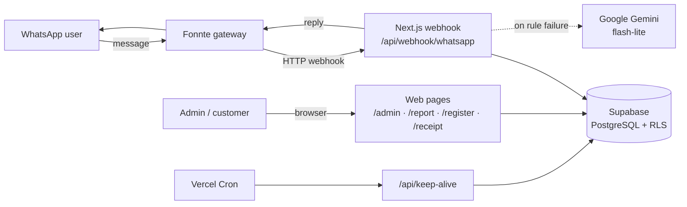
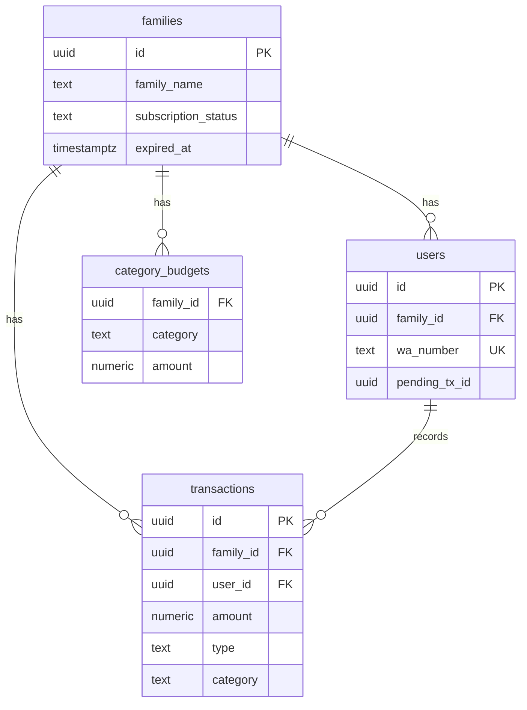
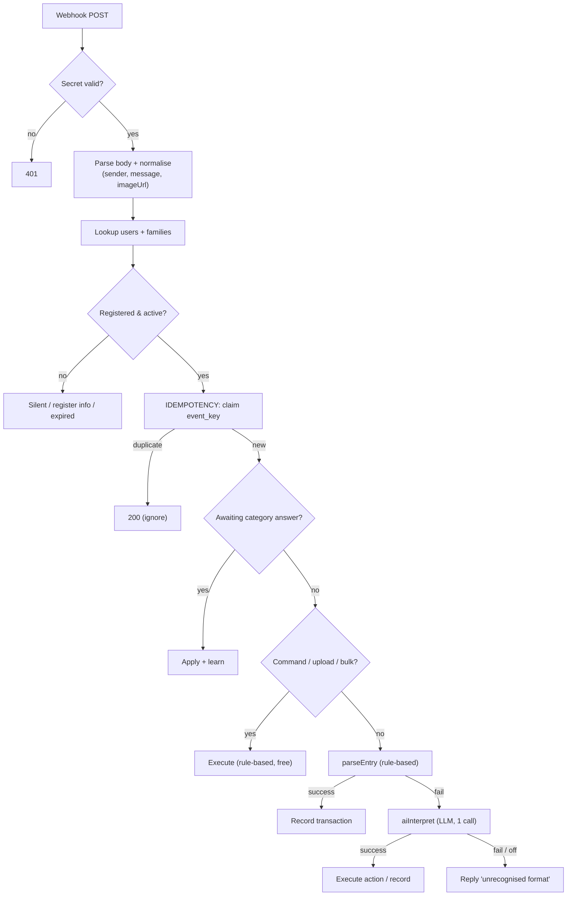
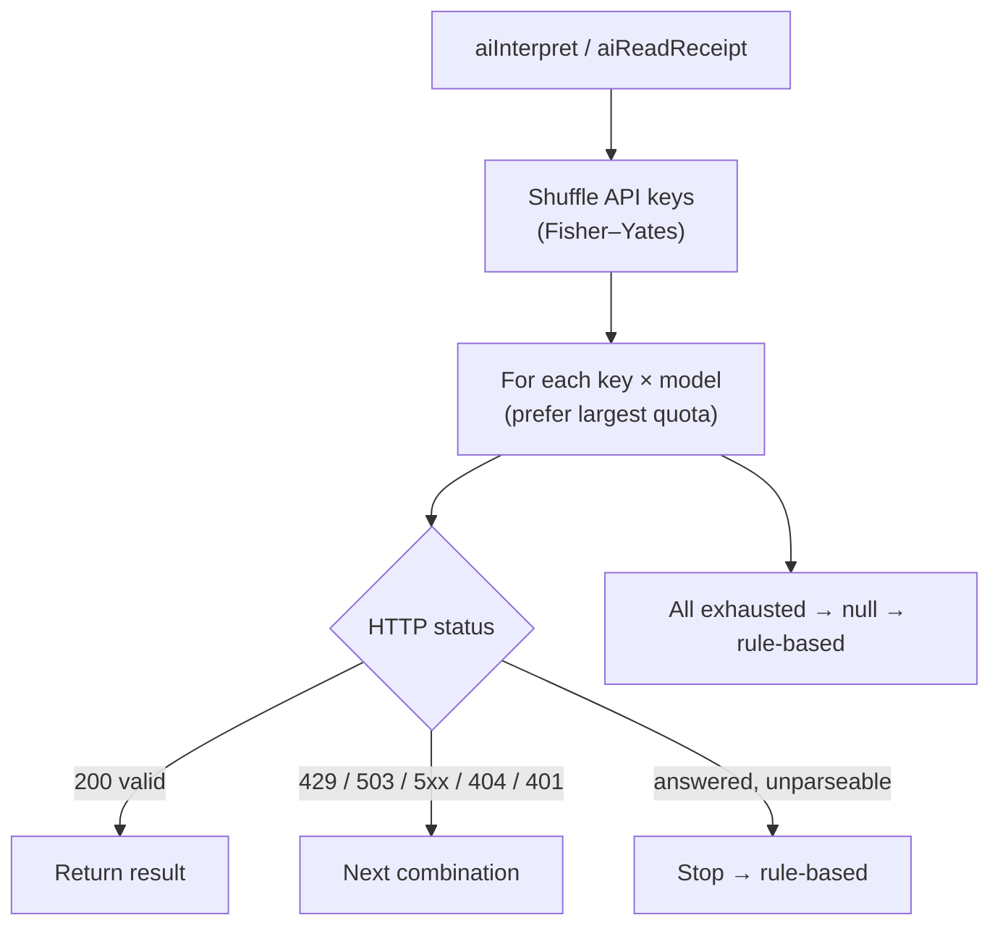
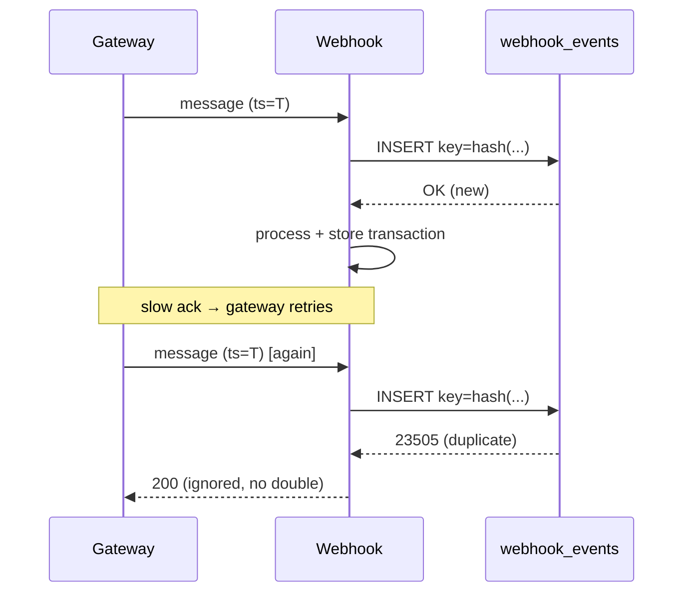

# Technical System Document
## A Multi-Tenant WhatsApp-Based Family Finance SaaS with Hybrid (Rule-based + LLM) Natural-Language Processing

> This document describes the **architecture, data model, and core algorithms** of
> the system as the object of study for a master's thesis/paper. The **Literature
> Review**, **Research Methodology**, and **Empirical Evaluation** should be written
> by the researcher; this document supplies a citable technical description.

---

## 1. Overview & Engineering Goals

The system is a **multi-tenant Software-as-a-Service (SaaS)** for family finance
tracking, operated entirely through **WhatsApp**. A single central bot number
serves many families; data ownership is distinguished by the **sender's phone
number**. Users record transactions in everyday language (e.g. `Bensin 50rb` /
"petrol 50k"), and the system extracts `{type, name, amount, category}` using a
**hybrid** approach: a deterministic rule-based parser as the primary path, and a
**Large Language Model (LLM)** as a fallback invoked only when rules fail.

### 1.1 Engineering objectives
1. **Accessibility** — no app install; uses the WhatsApp users already have.
2. **Multi-tenant isolation** — data must not leak across families.
3. **Cost efficiency** — minimise paid/quota-limited LLM calls.
4. **Reliability** — resilient to duplication (gateway retries) and component failure.

### 1.2 Technology stack

| Layer | Technology | Role |
|---|---|---|
| User interface | WhatsApp (Fonnte gateway) | Primary I/O channel |
| Web/Server | Next.js 15 (App Router), TypeScript | Webhook, web pages, APIs |
| Compute | Vercel (serverless + Cron) | Hosting & scheduling |
| Database | Supabase (PostgreSQL + RLS) | Multi-tenant storage |
| LLM (optional) | Google Gemini (flash-lite) | Fallback NLU + receipt OCR |
| Visualisation | Chart.js | Report charts |

---

## 2. System Architecture

The system follows a **thin gateway, fat webhook** pattern: the gateway merely
forwards messages; all business logic resides in a single stateless server
*route handler*. Being stateless matters for the serverless environment — every
request is self-contained and all state lives in the database.



### 2.1 Key design principles
- **The trusted server uses `service_role`** (bypassing RLS). Write-path tenant
  isolation is enforced in **code**: `family_id` always comes from a server-side
  lookup of the `sender`, never from client input.
- **Adapter layers** for the outbound gateway (`response`/`fonnte`/`cloud`) and the
  AI provider — migration is an environment-variable change.
- **Rule-based first, AI last** — the LLM is invoked only when rules fail.

---

## 3. Data Model & Multi-Tenancy



Supporting tables: `budget_logs` (envelope-change audit), `category_memory`
(name→category learning), `pricing_config` & `packages`, `registrations`,
`webhook_events` (idempotency).

### 3.1 Row Level Security (RLS)

A `security definer` helper maps the authenticated dashboard user to their
`family_id`; each policy restricts rows to that family.

```sql
-- maps logged-in user -> family_id (used by all policies)
create function current_family_id() returns uuid
language sql stable security definer set search_path = public as $$
  select family_id from users where auth_user_id = auth.uid() limit 1;
$$;

create policy "tx: select own family" on transactions for select
  to authenticated using (family_id = current_family_id());
```

### 3.2 Threat model & mitigation

| Access path | Credential | Isolation enforcement |
|---|---|---|
| Webhook (server) | `service_role` (RLS bypass) | by **code**: `family_id` from `sender` lookup |
| Dashboard (browser) | `authenticated` | by **RLS**: `current_family_id()` |
| `anon` (no login) | — | fully denied (no policy) |

---

## 4. Message Processing Pipeline

Each message passes through an ordered pipeline. Principle: cheap, deterministic
checks first; the LLM last. For the majority of short-format messages, execution
halts *before* the LLM stage — hence zero AI cost.



---

## 5. Rule-based Information Extraction

### 5.1 Tiered amount extraction (`parseTransactionMessage`)
1. **Digits + unit** — regex captures a number (with `.`/`,` separators) plus an
   optional unit (`rb/k`×1,000, `jt`×1,000,000); the **last** occurrence is taken
   (heuristic: amounts usually end the sentence).
2. **Number-in-words** (`parseIndoNumber`) — when no digits are present; an
   accumulating automaton processes Indonesian units/tens/hundreds/thousands/millions
   and the "se-" prefix; local slang (`goceng`=5,000, `ceban`=10,000) maps directly.
3. **Anti-error** — word-numbers are accepted only if a scale word is present, so
   "one meatball" is not misread as Rp1.

```
FUNCTION parseIndoNumber(text):
  expand "se-" (sepuluh→satu puluh, seratus→satu ratus, ...)
  result←0; group←0; unit←0
  FOR each token:
    IF unit(1..9): unit ← value
    IF "belas": group += 10 + unit;          unit←0
    IF "puluh": group += (unit|1) * 10;        unit←0
    IF "ratus": group += (unit|1) * 100;       unit←0
    IF "ribu":  group += unit; result += (group|1)*1_000;     group←0; unit←0
    IF "juta":  group += unit; result += (group|1)*1_000_000; group←0; unit←0
  RETURN result + group + unit
```

### 5.2 Type & category classification
- **Type** — prefixes `masuk/pemasukan/terima/+` mark income; otherwise expense.
- **Category** — (a) keyword matching; (b) on miss, **fuzzy matching** with
  Levenshtein edit-distance ≤ 1 (e.g. `bensn`→`bensin`→Transport); (c) manual
  `#category` override.

### 5.3 Adaptive learning & staged clarification
When the user corrects/answers a category, the **name→category** pair is stored
(`category_memory`); similar future transactions are auto-categorised. When a
category is undetected, the system stores `pending_tx_id` on the user row and
asks — a lightweight *dialog state machine* whose state persists in the database,
not in serverless process memory.

---

## 6. Envelope Budgeting

Per-category budgeting via language commands: `amplop makan 2jt` (set),
`pindah makan transport 500rb` (transfer), `hapus amplop makan` (delete). Every
change is logged to `budget_logs`. Two concepts are kept explicitly distinct:
- **Envelope/budget** = a *plan* (an alarm, not a hard block).
- **Balance** = *reality* (income − expense); may go negative (indicating debt).

---

## 7. Hybrid LLM Processing

The LLM (Gemini) is called only when the rule parser fails, keeping most messages
free. Token efficiency is achieved through several simultaneous techniques:

| Technique | Effect |
|---|---|
| `thinkingBudget: 0` | disables internal "reasoning" tokens |
| small `maxOutputTokens` | caps JSON output (~50 tokens) |
| concise prompt | ~120 input tokens |
| structured JSON output | no preamble/explanation |
| single multi-purpose call | `aiInterpret`: intent + extraction at once |

### 7.1 Unified intent classification
`aiInterpret` maps free text to a single action: `record`, `set_budget`,
`move_budget`, `delete_budget`, `total`, `report`, `today`, `undo`, `help`, or
`none` — with parameters. This unifies "transaction" and "command" into **one**
LLM call.

### 7.2 Resilience: randomised key rotation + model chain



- **Randomised key rotation** spreads load evenly across accounts, lowering ban risk.
- **Model chain** yields graceful degradation on quota limits.
- **Per-call timeout**; failure → `null` → fall back to rule-based. The system
  **never stalls**.

### 7.3 Receipt OCR without storing images (privacy-by-design)
Because the free gateway tier does not forward media files, receipt upload uses a
web page `/struk/<family_id>`. The image is processed **in memory** (base64 →
Gemini vision → `{name, amount, category}`) then **discarded** — only the
transaction row is stored. This removes the need for object storage and shrinks
the privacy surface.

---

## 8. Reliability & Idempotency

Gateways may resend (retry) the same message if acknowledgement is slow — risking
**double recording**. As the gateway provides no stable message ID, a
deterministic idempotency key is synthesised:

```
event_key = SHA-256( sender | timestamp | message | imageUrl )
```

The key is `INSERT`ed into `webhook_events` (primary key). A uniqueness violation
indicates a retry → the request is ignored with no side effect. Old rows are
auto-pruned (>7 days) by the cron.



Additional reliability: a daily **keep-alive cron** prevents free-tier database
auto-pause and prunes markers; a **reply-delivery adapter** eases provider
migration; **quota thrift** — unregistered numbers are silently ignored unless
they intend to register.

---

## 9. Supporting Business Flows

- **Self-registration** — type `daftar` → web form → `registrations` (pending) →
  admin approval → the system automatically creates `families` + `users` + an
  active period matching the plan.
- **Dynamic pricing** — `total = (group_price + members × member_price) × months`,
  configured via the admin panel.
- **Reporting** — text commands (`total`, `report`) and a responsive web page with
  charts (daily trend, composition, envelope status).

---

## 10. Technical Contributions & Evaluation Metrics

Points suitable as contributions/novelty:
1. **A chat-channel multi-tenant SaaS architecture** with dual isolation (RLS for
   the dashboard + code enforcement for the `service_role` webhook).
2. **A cost-efficient hybrid NLP pipeline** — rule-based primary, LLM minimal-cost
   fallback.
3. **An Indonesian numeric parser** (digits + words + slang) with scale-presence
   anti-error.
4. **Practical LLM resilience** — randomised key rotation + model chain + timeout
   fallback for free-quota environments.
5. **ID-less idempotency** via deterministic key synthesis.
6. **Privacy-by-design OCR** — image processing without storage.

### Suggested evaluation metrics (for the researcher)
- Extraction accuracy (amount/type/category): rule-based vs hybrid.
- Proportion of messages handled without the LLM (cost efficiency).
- Average latency (rule-based vs LLM).
- Duplicate-prevention rate from idempotency.
- Receipt OCR accuracy.

---

*This is technical documentation of a system built by the researcher. Adapt the
writing style, add citations, a methodology framework, and evaluation results per
your institution's guidelines.*
